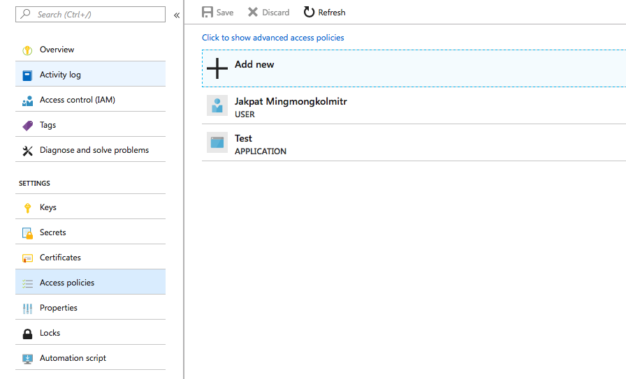

## Getting Started

### Create Key Vault resource

if you don't have any Key Vault resource in the Azure

- Take a look at this [quick start](https://docs.microsoft.com/en-us/azure/key-vault/quick-create-portal)

And keep a Vault URI, for example https://contoso-vault2.vault.azure.net/.

### Create Azure service principle

To let our application

- Follow this [document](https://docs.microsoft.com/en-us/azure/azure-resource-manager/resource-group-create-service-principal-portal)

Keep Application ID, Authentication Key and Tenant ID

### Set Resource Access policy

Select Access policies tab in your resource

Click Add new and add your application



### Configuration
Set the following value to `Config.kt` file.
```js
    AZURE_TENANT_ID = "Tenant ID"
    AZURE_CLIENT_ID = "Application ID"
    AZURE_CLIENT_SECRET = "Authentication Key"
    VAULT_BASE_URL = "Key Vault URI"
```
